# ai-terminal

AI コーディングエージェント（Claude Code / Gemini CLI）を飼うことに最適化した、macOS 向けの自作ターミナルアプリ。

普段使いのターミナルとして動きつつ、左サイドバーで「いま AI が何をしているか」が常に見えて、過去のセッションをワンクリックで再開できる。

- 設計の全体像 -> [docs/PLAN.md](docs/PLAN.md)
- Docker 環境の使い方 -> [docs/DOCKER.md](docs/DOCKER.md)
- AI エージェントの隔離実行 -> [docs/SANDBOX.md](docs/SANDBOX.md)
- 実装ルール -> [CLAUDE.md](CLAUDE.md)

---

## 必要なもの

| | 用途 | 必須 |
|---|---|---|
| Node.js 22 系 | ビルドと実行 | 必須 |
| macOS | 動作対象 | 必須 |
| `claude` コマンド | Claude Code 連携 | 連携機能を使う場合 |
| `gemini` コマンド | Gemini CLI 連携 | 連携機能を使う場合 |
| `tmux` | セッション永続化（アプリを落としても AI の作業が生き残る） | 任意 |
| Docker | 検証コンテナ / サンドボックス | 任意 |

`claude` / `gemini` は **API キーではなく CLI のサブスクリプション認証をそのまま使う**設計なので、事前に各 CLI でログインを済ませておくこと。

---

## 起動方法

```bash
make install   # 依存のインストール（初回のみ）
make dev       # アプリを起動
```

`make` を使わない場合:

```bash
npm install
npm run dev
```

**アプリ本体は必ずホスト（macOS）で起動する。** GUI を Docker で動かす構成は用意していない（日本語 IME とフォントが壊れるため、設計段階で意図的に除外している）。詳細は [docs/DOCKER.md](docs/DOCKER.md)。

### 本番ビルド

```bash
make build     # out/ に main / preload / renderer を出力
```

開発時は Vite の dev server（`localhost:5173`）経由で Renderer を読み込むが、**ビルド後はポートを一切使わない**（ローカルファイルを直接読む）。

### 安定版（パッケージ済み .app）を作る

`make dev` で常用していると、コード変更や再起動のたびに PTY ごとセッションが途切れる。**日常のエージェント飼育は安定版の .app、開発は `make dev`** と分けるためのビルドがこれ。

```bash
make package       # dist/ に ai-terminal.app と dmg を生成
make install-app   # 上記に加えて /Applications へ入れ替えるところまで一括
```

- 生成物は `dist/mac-arm64/ai-terminal.app`（そのまま起動できる）と `dist/ai-terminal-<version>-arm64.dmg`（/Applications に入れるならこちら）。
- 署名は ad-hoc（ローカルビルドの起動には十分。配布は想定しない）。
- 安定版と `make dev` は**同時に起動できる**。データ保存先が分かれているため互いの設定・メモを壊さない（下の「設定」を参照）。
- 開発版を再起動しても安定版の PTY は無傷。安定版自体を更新したいときだけ `make install-app` し直し、途切れた Claude セッションは履歴一覧（`--resume`）から復帰する。
- **`make install-app` は安定版が起動中だと中止する。** このアプリは AI エージェントの PTY を抱えているので、動いたまま `.app` を差し替えると実行中のセッションを巻き添えで失う。勝手に終了させることはしないので、自分で終了してから実行する。
- **`make install-app` は入れ替えの直前に、生成した .app そのものに対してスモーク E2E（起動・claude タブ・タスク一覧・PATH 解決の4本）を自動実行する。** 落ちた場合は `/Applications` を入れ替えずに中止するので、壊れた安定版で上書きしてしまうことがない。スモークだけを手で回したいときは `make e2e-packaged`。

---

### デバッグ

開発起動（`make dev`）では **DevTools が別ウィンドウで自動的に開く**。手動で開閉する場合は `Cmd+Option+I`。

```bash
make dev-quiet   # DevTools を開かずに起動する
make dev-debug   # Main プロセスのデバッガを有効にして起動する
```

`make dev-debug` は `--inspect --sourcemap` 付きで起動するので、Chrome の `chrome://inspect` か VS Code の Attach 構成から Main プロセスに接続できる。PTY の起動引数や `claude agents --json` のパース結果を追いたいときはこちら。

**Main プロセスの `console.log` は DevTools ではなくターミナル側に出る**（`make dev` を実行している端末）。

---

## 使い方ガイド

以下の画像は E2E テスト（Playwright）の隔離ハーネス上で撮影したもの。**一時 HOME と偽の `claude` / `gemini` CLI を使っており、プロジェクト名・セッション内容・ユーザー名はすべてダミー**。実在のプロジェクトやセッションではない。

### 1. 起動するとどう見えるか

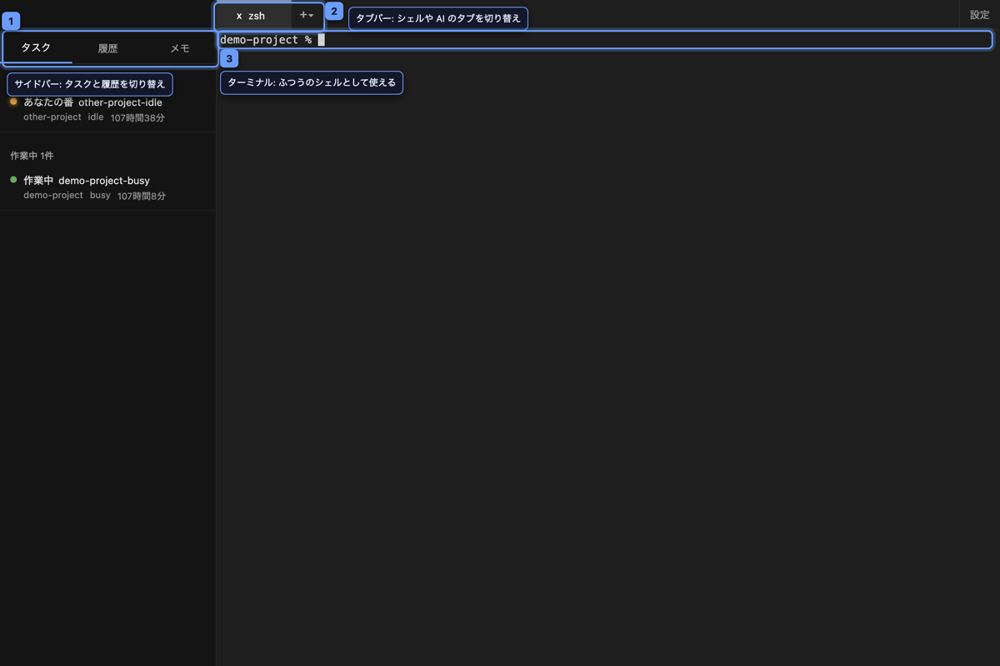

左に「実行中タスク / 履歴 / メモ」を切り替えるサイドバー、上にシェルや AI エージェントのタブを並べるタブバー、その下にターミナル本体が並ぶ。ターミナル部分はいつもの `zsh` / `bash` のプロンプトがそのまま表示される。

### 2. 普通のターミナルとして使う

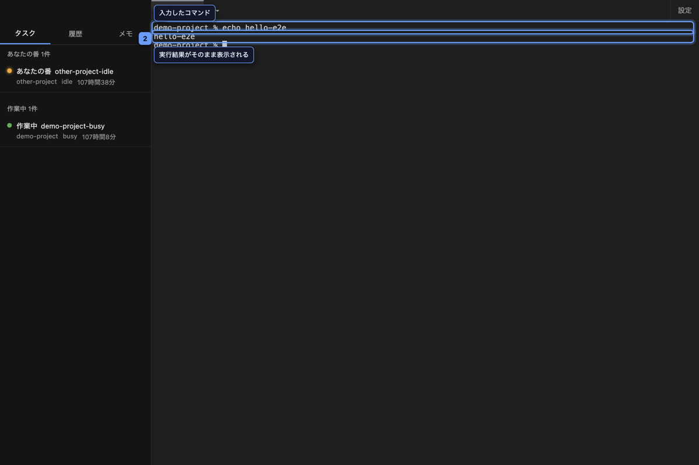

コマンドを打てば結果がそのまま返る。PTY の出力はアプリ側で加工していないので、CLI 側の色付けやプログレス表示もそのまま流れてくる。

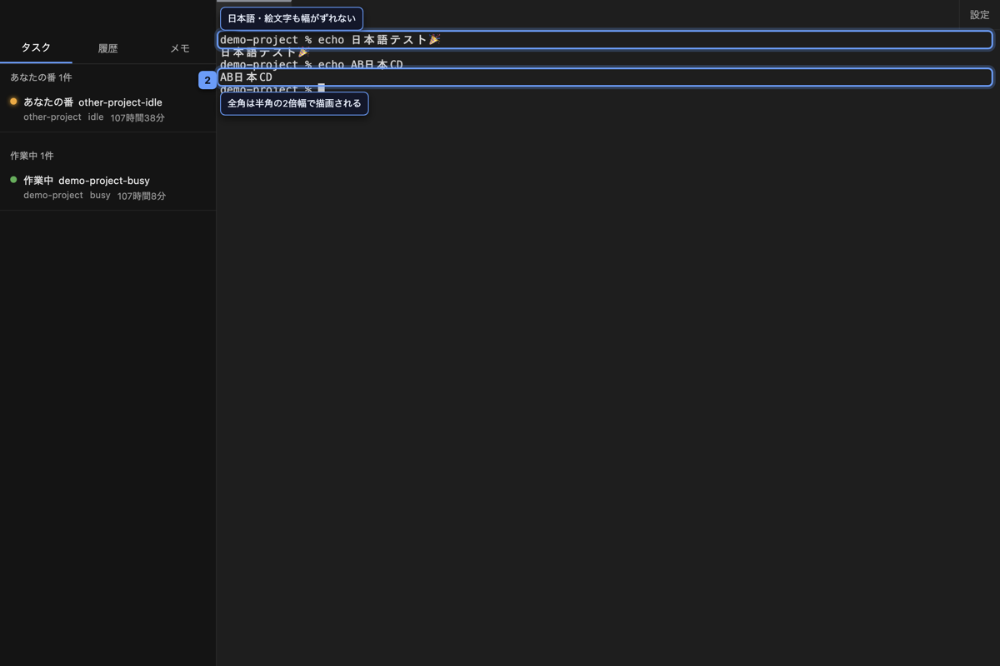

日本語や絵文字も文字幅がずれずに描画される（全角は半角のちょうど2倍幅）。`vim` や `htop` のような画面を書き換えるタイプの CLI もそのまま動く。

**Finder からファイルやフォルダをターミナルへドラッグ&ドロップすると、その絶対パスがカーソル位置に挿入される。** 複数をまとめて落とせばスペース区切りで並び、末尾にもスペースが1つ入るので、そのまま `--flag` を続けて打てる。名前に空白や記号が含まれていても、シェルが1つの引数として解釈する形にエスケープされる（`/Users/me/My Documents/a.txt` なら `/Users/me/My\ Documents/a.txt`）。日本語や絵文字はエスケープせずそのまま挿入する。

挿入先は、アクティブなタブではなく**落とした先のターミナル**。タブを分割していて複数のペインが同時に見えている場合も同様で、**カーソルの下にあるペイン**に挿入される（アクティブなペインとは限らない）。

### 3. タブを増やす

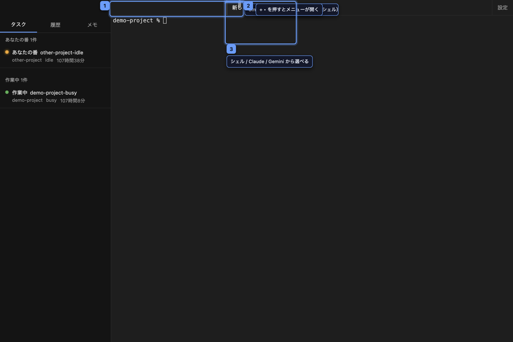

`Cmd+T` で新しいシェルタブが開く。タブごとに独立したシェルで、`Cmd+W` で閉じられる（最後の1枚を閉じると新しいシェルが自動的に開く）。**タブの中をさらに分割している場合、`Cmd+W` はアクティブなペインだけを閉じる。タブそのものが閉じるのは、そのタブに残っているペインが1枚だけのとき**（「ターミナルを分割する」を参照）。

**「+ ▾」は分割ボタン。** 押すとメニューが開き、「新しいシェル」「Claude」「Gemini」から選べる。AI エージェントを起動する導線がショートカット（`Cmd+Shift+C` / `Cmd+Shift+E`）とメニューバーだけだった頃は、説明書を読まずにこのアプリを触った人が Claude / Gemini を起動する手段に画面上から気づけなかった。

**タブは上端の色でプロバイダを表す**（シェル / claude / gemini）。色が見分けにくい場合に備えて、タブにポインタを合わせるとプロバイダ名がツールチップで出る。スクリーンリーダーにも必ず読み上げられる。

**閉じるボタンはタブの左側にあり、選択中のタブとポインタを合わせたタブにだけ出る**（Terminal.app や Safari と同じ）。閉じたいだけなのに全タブに常時ボタンが並ぶのを避けるため。

**キーボードだけでもタブを操作できる。** タブバーに Tab キーで入ると選択中のタブに止まり、左右の矢印キーでフォーカスだけが隣のタブへ移る（**この時点ではまだ切り替わらない**）。`Enter` か `Space` で初めて切り替わる。`Delete` か `Backspace` でそのタブを閉じられる（タブバーの x ボタンと同じ経路なので、分割していて2枚以上のペインが動いている場合は確認ダイアログを挟む）。

### 4. AI エージェントを起動する

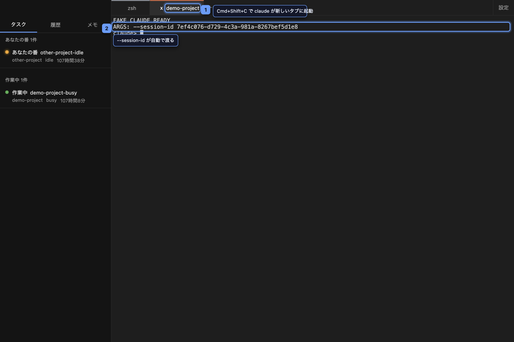

`Cmd+Shift+C` で現在の作業ディレクトリを引き継いだまま `claude` が新しいタブとして起動する（`Cmd+Shift+E` なら `gemini`）。メニューバーの「ファイル」からも開ける。起動時にアプリ側が採番した UUID を `--session-id` として渡しており、これが後述のタスク一覧・履歴との突き合わせキーになる。

**引き継がれるのは「シェルタブで `cd` した先」**。シェルタブで別のリポジトリへ移動してから `Cmd+Shift+C` を押せば、エージェントはその移動先で起動する。設定は要らず、`.zshrc` に何かを仕込む必要も無い（アプリが OS にプロセスの作業ディレクトリを聞いている）。サイドバーの履歴一覧・タスク一覧の絞り込みも、同じディレクトリに追従する。

### 5. 実行中タスクを一覧で見る

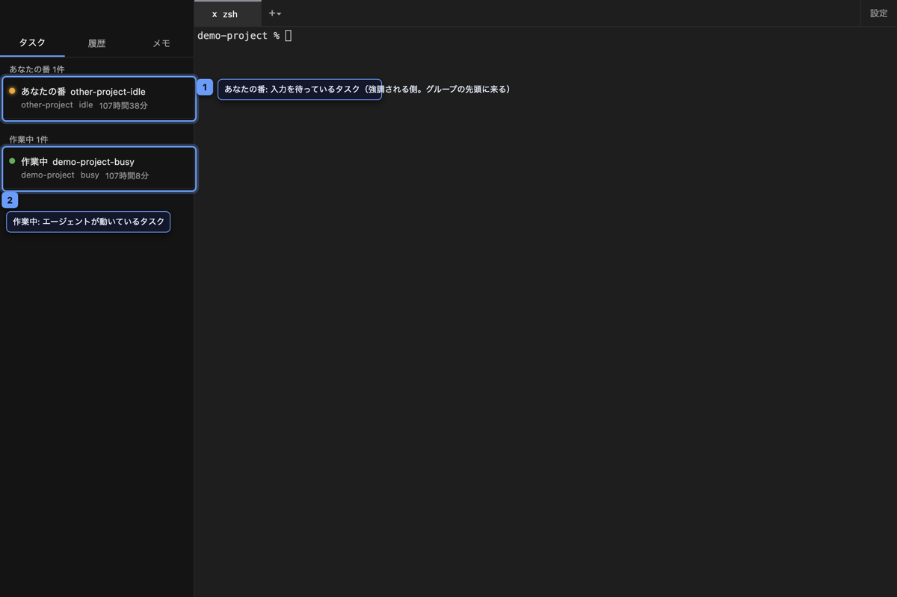

サイドバーの「タスク」タブには、いま動いている `claude` セッションが `claude agents --json` のポーリングで一覧表示される。**あなたの入力を待っているセッション**（CLI の `idle`）が目立つオレンジ、**エージェントが作業中のセッション**（同 `busy`）が緑の点で区別される。CLI が返した生の状態文字列も併記されるので、`busy` / `idle` 以外の未知の状態が来たときは「不明」と表示したうえで元の値が読める。他のプロジェクトで動かしているセッションも（同一マシン上なら）一緒に見える。

一覧は**状態でグループ分けされ、「あなたの番」が常に先頭**に来る。CLI が返した順のままだと、あなたを待っている行が下に沈んで見落とされるため。「あなたの番 2件」のような見出しが入るので、**どこが境目かは色が見分けられなくても分かる**（色・語・区切りの3つが独立に同じことを伝える）。未知の状態は「あなたの番」に混ぜず、3つ目のグループとして末尾に置く。

「あなたの番」の行には、**そのセッションを何分待たせているか**が出る（グループ内も待たせている時間が長い順に並ぶ）。アプリを起動する前から待っていたセッションや、アプリを再起動した直後など、状態が変わる瞬間をアプリが見ていない場合は、代わりにセッション起動からの通算時間が出る。

### 6. 過去のセッションを再開する

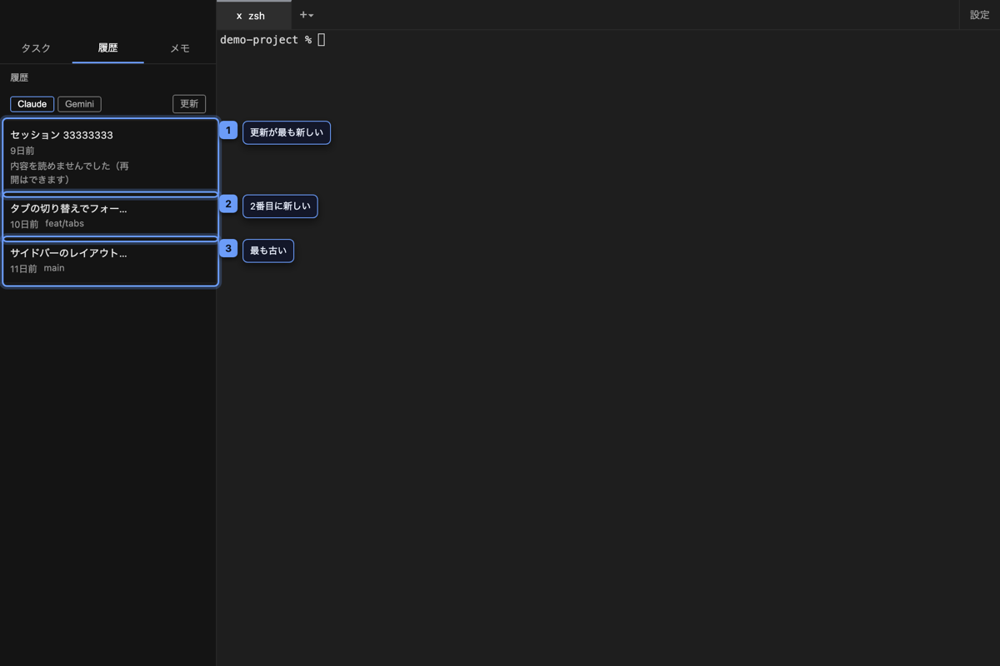

サイドバーの「履歴」タブには `~/.claude/projects` 以下のセッション履歴が更新時刻の降順で並ぶ。タイトルは AI が生成したもの（`ai-title`）を使い、無ければ最初のプロンプトの冒頭を代わりに表示する。

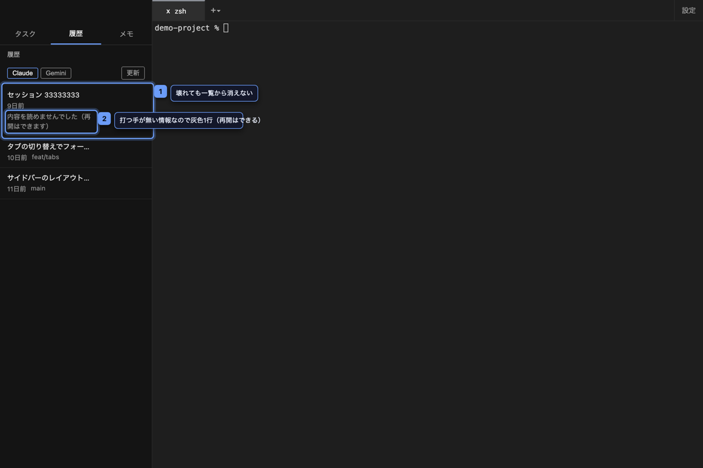

セッションの JSONL は Claude Code 公式が「内部フォーマットでバージョン間に変わりうる」と明記しているため、パースに失敗したセッションも一覧から消さず、sessionId と更新時刻だけで縮退表示する（CLAUDE.md の設計方針そのもの）。

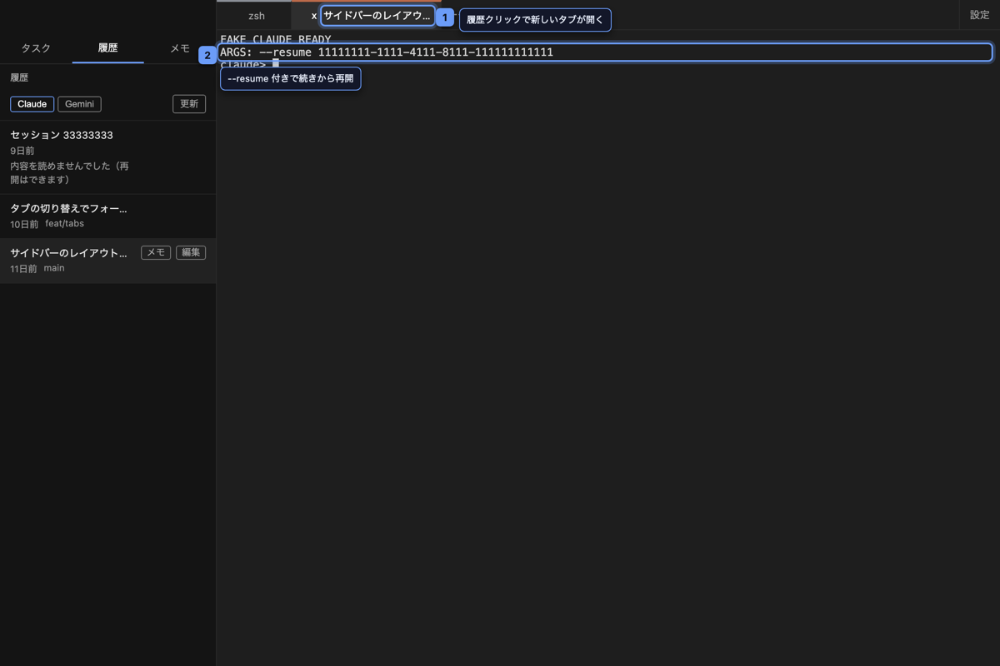

履歴をクリックすると新しいタブが開き、`claude --resume <sessionId>` で続きから再開できる。

### 7. メモを残す

サイドバーの「メモ」タブに、どこにも属さない**全体メモ**と、履歴セッションに紐付く**セッションメモ**を書ける。

- **全体メモ**: 常に1枚だけの走り書き。「あとで直す」「このブランチの前提」など、行き場のないメモの置き場
- **セッションメモ**: 履歴一覧の行にカーソルを合わせると出る「メモ」ボタンから開く。そのセッションの調査経過や、次に何を頼むかを残せる

保存ボタンは無い。入力が止まると自動で保存され、入力欄から離れたときにも保存される。**書いた直後にアプリを終了しても失われない**（保存待ちの内容は終了時に書き出される）。**本文を空にするとそのメモは削除される**（空のメモが一覧に残り続けない）。

保存先は `~/.ai-terminal/memos.json`。`claude` / `gemini` 側のファイルには一切書き込まない。

### 8. 日本語を入力する

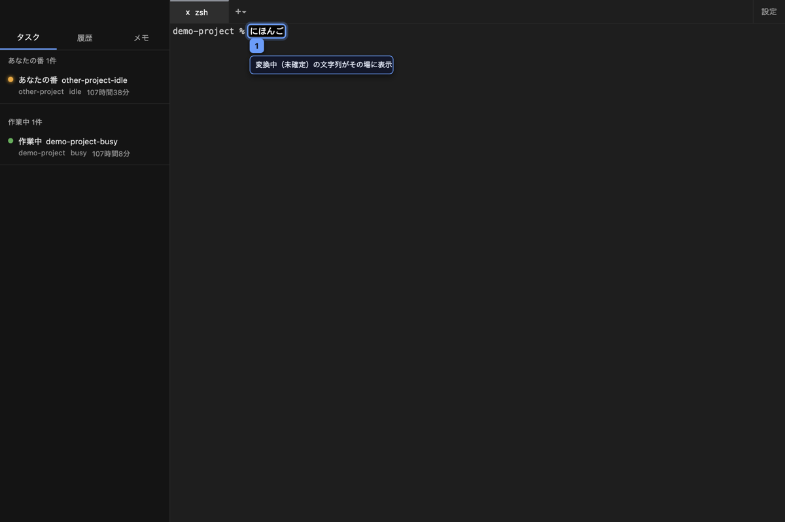

日本語 IME の変換中（未確定）の文字列もその場に表示され、確定すると通常どおりシェルに渡る。

**ただし、入力側の IME は自動テストの対象外。** E2E が担保しているのは、日本語を含む**出力**の文字幅（S04）と、xterm.js 側の composition 処理（S22）まで。S22 は Chromium の DevTools Protocol で変換中の状態を作っているだけで、macOS の入力メソッド（ことえり等）そのものは動かしていない。**OS の入力メソッドとの相互作用は担保していないので、実機での確認が要る。** 手順は [.claude/skills/terminal/operations/verify-terminal.md](.claude/skills/terminal/operations/verify-terminal.md) の手動チェックリストにある。

### 9. 通知とサウンドを設定する

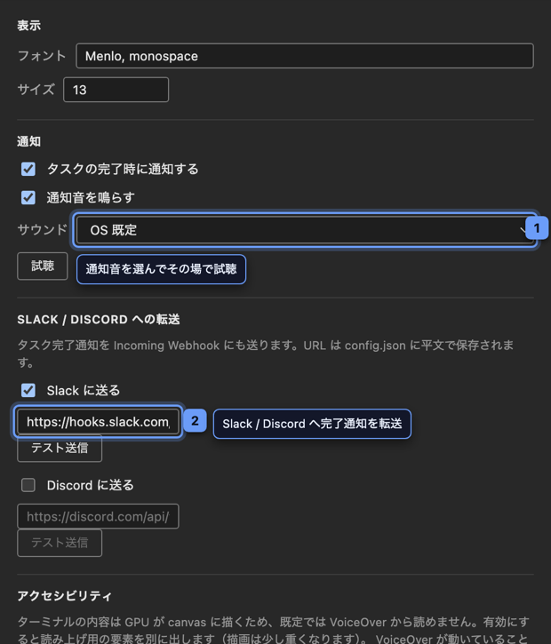

タブバー右端の「設定」ボタン、メニューバーの「ai-terminal > 設定...」、または `Cmd+,` で**設定ウィンドウ**が開く。macOS の作法に合わせた非モーダルの独立ウィンドウなので、**開いたままターミナルを操作できる**。閉じるのはウィンドウのクローズボタン・`Esc`・`Cmd+W` のいずれか。

`config.json` を手で編集しなくても、次を変更できる。

- **フォントと文字サイズ** — 変更するとその場でターミナルに反映される
- **通知音** — macOS のシステムサウンド（`/System/Library/Sounds`）と `~/Library/Sounds` に置いた音源から選べる。「試聴」でその場で鳴らせる
- **Slack / Discord への転送** — Incoming Webhook の URL を入れると、タスク完了通知が Slack / Discord にも届く。「テスト送信」で保存前に到達を確認できる
- **動作** — tmux でのラップ、**タスク一覧を現在のディレクトリに絞り込む**、ポーリング間隔

**「タスク一覧を現在のディレクトリに絞り込む」**を有効にすると、サイドバーのタスク一覧が、**いま見ているシェルタブがいるディレクトリ**の配下で動いているセッションだけになる（`claude agents --json --cwd <path>` で絞る）。複数のプロジェクトを並行して回していて、いま見ているプロジェクトのタスクだけを見たいときに使う。`cd` すれば数秒で追従し、タブを切り替えればそのタブのディレクトリに切り替わる。**タブを分割している場合、実際に見ているのは「今アクティブなペイン」のディレクトリ**（ペインを切り替えればそのペインのものに変わる）。`cd` への追従はアクティブなペインだけが対象で、裏に隠れている非アクティブなペインの `cd` は拾わない。

変更は即座に `~/.ai-terminal/config.json` に保存される（保存ボタンは無い）。

> **Webhook URL は `config.json` に平文で保存される。** リポジトリに含まれる場所ではないが、設定ファイルを共有・バックアップするときは注意すること。

### 10. ターミナルを分割する

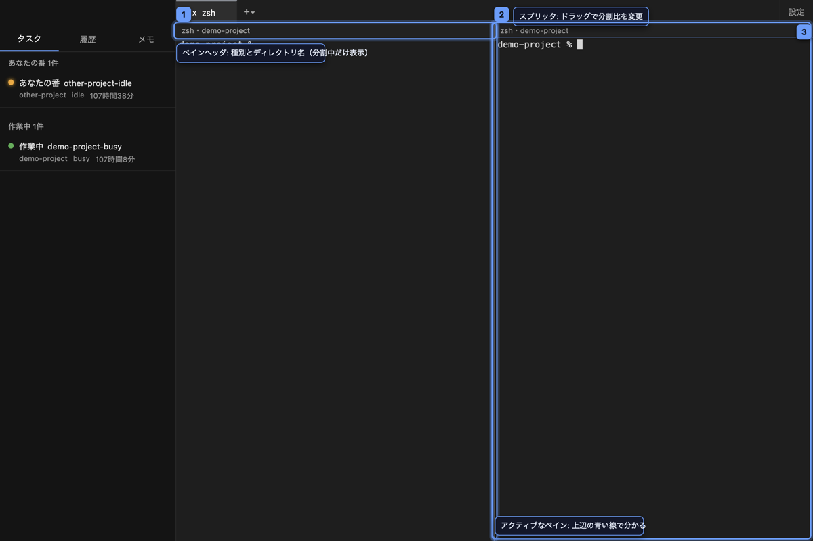

`Cmd+D` でアクティブなペインを左右に分割し、右側に新しいシェルが立つ。`Cmd+Shift+D` なら上下に分割する。**分割で新しく作られるのは常にシェルのペイン**で、`claude` / `gemini` のペインを分割しても隣にもう1本同じエージェントが起動するわけではない（エージェントの隣で `git` や `ls` を打つのが主な用途）。分割したペインはさらに分割でき、二分木としていくらでも深くできる。

**分割中だけ**、各ペインの上に高さ18pxのヘッダが出る（1ペインのときは出ない）。`zsh` / `claude` / `claude (再開)` のような種別と、そのペインの cwd のディレクトリ名（basename）を示す。

アクティブなペイン（キー入力が届く側）は次の3つで分かる。

- ペイン上端の細い青いアクセント線
- xterm.js 標準の、非フォーカス時に中空になるカーソル（追加コスト無しの既存の手がかり）
- ペインヘッダの文言

ペインをクリックすればそちらがアクティブになる。`Cmd+]` / `Cmd+[` で次・前のペインへ、`Cmd+Option+矢印`（上下左右）なら方向を指定してペイン間を移動できる。

**ペイン境界（スプリッタ）はドラッグでサイズを変更できる。** ドラッグ中は xterm の再描画や PTY の resize を発生させず、指を離した瞬間に一度だけ確定する。スプリッタをマウスで掴みにくいときは、メニューの「表示 > 分割比を広げる / 狭める / 50% に戻す」からも調整できる。**分割は無制限ではない。** 左右分割は結果として各ペインの横幅が実測20桁を下回る場合、上下分割は各ペインの縦が実測20行を下回る場合に拒否され、理由が通知に出る（既定のフォントサイズなら、既定のウィンドウ幅で同じ方向へ分割を繰り返すとどこかで端に達する）。

Finder からのファイル・フォルダのドラッグ&ドロップは、カーソルの下にあるペインへ落ちる（4辺の青い枠でどこに落ちるかが分かる）。

`Cmd+W` は**アクティブなペインだけを閉じる**。タブに残っているペインが1枚だけならタブそのものが閉じ、最後の1枚を閉じたときと同じく新しいシェルが自動的に開く。**タブバーの x ボタンやメニューの「タブを閉じる」でタブごと閉じようとしたときは、2つ以上のプロセスが同時に終了する場合だけ確認ダイアログが出る**（何本のプロセスが終わるかは x ボタンにポインタを合わせると事前に分かる）。

`Cmd+Shift+Enter` でアクティブなペインを一時的に画面いっぱいに広げられる（もう一度押すと元に戻る）。分割の比率は変わらず、隠れた側の PTY も終了しない。既定のウィンドウ幅の左右2分割は1ペインあたりの桁数が少なく `git diff` 等が折り返しやすいため、広い画面が必要な場面の一時的な逃げ道として使う。

実行中タスク一覧のクリックや OS 通知は、対象のセッションが同じタブの非アクティブなペインにある場合、そのペインへフォーカスを移す。対象のペインが既に見えている場合は画面を変えず、「〇〇は既に表示されています」という通知で伝える。

> 分割で新しいシェルを作ったとき引き継ぐのは、分割元のペインがそのとき居たディレクトリ。`claude` / `gemini` のペインは実行中に内部で `cd` してもその変化を追跡していないため、分割で作ったシェルがエージェントの現在地とずれることがある（ペインヘッダの cwd 表示で気づける）。tmux 経由で起動している場合、追跡できる cwd は tmux クライアント側のものになる。

**マウスだけで分割を始める専用ボタンは、現時点では無い。** `Cmd+D` / `Cmd+Shift+D`、またはメニューの「ファイル > 右に分割 / 下に分割」から行う。

### 11. うまくいかないとき

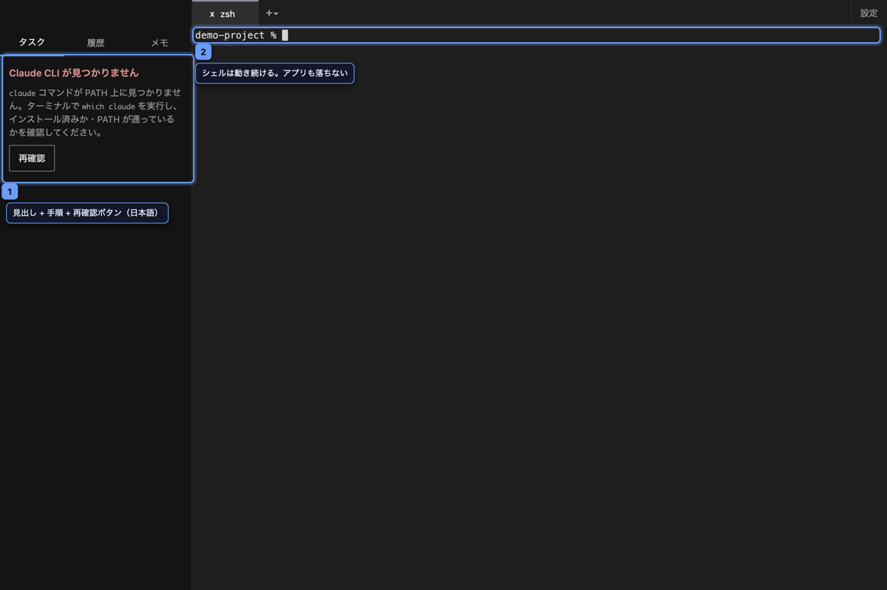

`claude` が PATH に無いときは、サイドバーのタスク一覧に「Claude CLI が見つかりません」という専用の空状態パネル（見出し・手順・「再確認」ボタン）が表示される。この見出しは検知した最初の1回だけ赤字で目立ち、以降の自動チェックでは静かな表示に落ちる（一度伝えたことを毎回騒がしく繰り返さないため）。この状態でもアプリ本体は落ちず、既存のシェルタブは普通に使い続けられる（縮退動作の一例）。他のトラブルシューティングは [うまく動かないとき](#うまく動かないとき) を参照。

---

## キーボードショートカット

| キー | 動作 | メニュー |
|---|---|---|
| `Cmd+T` | 新しいシェルタブ | ファイル |
| `Cmd+D` | アクティブなペインを右に分割 | ファイル |
| `Cmd+Shift+D` | アクティブなペインを下に分割 | ファイル |
| `Cmd+Shift+C` | 現在の作業ディレクトリで **claude** を新しいタブで起動 | ファイル |
| `Cmd+Shift+E` | 同様に **gemini** を起動（g-**E**-mini の E） | ファイル |
| `Cmd+W` | アクティブなペインを閉じる（**意味変更**。タブに残るペインが1枚だけならタブごと閉じ、最後の1枚を閉じたときと同じく新しいシェルが開く） | ファイル |
| （キー無し） | タブを閉じる（ラベルに残っているペイン数が出る。2枚以上なら確認ダイアログを挟む） | ファイル |
| `Cmd+F` | ターミナル内検索（アクティブなペイン対象） | 編集 |
| `Cmd+G` | 検索を次のヒットへ進める（検索欄にフォーカスが無くても効く） | 編集 |
| `Cmd+Shift+G` | 検索を前のヒットへ戻す（同上） | 編集 |
| `Cmd+K` | 画面を消去（アクティブなペインの表示とスクロールバックのみ。シェルの状態は変えない） | 表示 |
| `Cmd+Shift+Enter` | アクティブなペインの最大化をトグル | 表示 |
| `Cmd+]` / `Cmd+[` | 次 / 前のペインへ移動 | 表示 |
| `Cmd+Option+↑↓←→` | その方向のペインへ移動 | 表示（4項目） |
| （キー無し） | 分割比を広げる / 狭める / 50% に戻す（スプリッタのドラッグの代わり） | 表示 |
| `Cmd+,` | 設定ウィンドウを開く | アプリ名 |
| `Cmd+1` 〜 `Cmd+9` | タブ切り替え（ペインではなくタブ単位） | （メニューには載せていない） |

`Ctrl+C` などターミナル本来のキー入力は一切妨げない（`Cmd` 系のみを横取りしている）。`Cmd+]` / `Cmd+[` が基本の移動キーで、`Cmd+Option+矢印` は3ペイン以上で方向を指定したいときに使う想定。

### スクリーンリーダーで使う

ターミナルの内容は GPU が canvas に描いているため、**既定のままでは VoiceOver から1文字も読めない**。設定ウィンドウの「アクセシビリティ」で「ターミナルの内容をスクリーンリーダーから読めるようにする」を有効にすると、読み上げ用の要素が別に出る（描画は少し重くなる）。

**VoiceOver が動いていることを検知できたときは、この設定に関わらず自動的に有効になる。** 設定の存在を知らなくても読める状態になるのが狙い。

### コントラストを上げる

macOS の「システム設定 > アクセシビリティ > ディスプレイ > コントラストを上げる」に追従する。**アプリ側の設定は要らない。** 有効にすると、弱い文字が1段濃くなり、一覧の区切り線・選択中のタブ・分割中のアクティブなペインの枠線がはっきりする。

既定の配色でも、文字は WCAG 2.2 の AA（4.5:1）を、入力欄とボタンの枠は非テキストの 3:1 を満たしている。**唯一届いていないのが選択中タブの塗り**で、これは塗りだけで選択状態を示している構造そのものの問題なので、上の設定でしのいでいる。

`Cmd+K` は iTerm2 / Terminal.app / Ghostty のいずれでも「画面を消去」なので、それに揃えている。AI CLI の起動は `Cmd+Shift+C` / `Cmd+Shift+E`。`Cmd+G` / `Cmd+Shift+G`（次を検索 / 前を検索）は Safari / Xcode / TextEdit など macOS 全域の標準キーに揃えている。

**`Cmd+R` では再読み込みされない。** ターミナルアプリで押し間違えると全タブの表示とスクロールバックが消えるため、本番のメニューからは再読み込みを外してある（開発起動時のみ「表示」メニューに残る）。

---

## 設定

**通知・サウンド・フォントはアプリ内の設定ウィンドウ（`Cmd+,`）から変更できる。** ここに書くのは、パネルに出していない項目も含めたファイルの全体像。

`~/.ai-terminal/config.json` を置くと反映される。ファイルが無ければ既定値で動く。**壊れた JSON を置いてもアプリは落ちず、既定値に縮退する。**

> **保存先は実行形態で分かれる。** パッケージ済みの安定版（`make package` で作った .app）は `~/.ai-terminal/`、`make dev` などの開発起動は `~/.ai-terminal-dev/` を使う（config / memos / session-titles すべて）。同時起動しても互いの設定・メモを壊さないための分離で、dev 側に設定を引き継ぎたいときは `cp -r ~/.ai-terminal ~/.ai-terminal-dev` する。環境変数 `AI_TERMINAL_DATA_DIR` で保存先を絶対パス指定に上書きすることもできる（E2E の隔離ハーネスが使用）。

```jsonc
{
  "shell": "/bin/zsh",              // 省略時は $SHELL
  "fontFamily": "Menlo, monospace",
  "fontSize": 13,
  "pollIntervalMs": 3000,           // タスク一覧の更新間隔
  "useTmux": true,                  // tmux があれば AI CLI をラップする
  "notifyOnIdle": true,             // 作業完了時に macOS 通知
  "notifySound": true,
  "notifySoundId": "Glass",         // 空文字なら OS 既定音。絶対パスで自前の音源も指定できる
  "slack": {
    "enabled": false,
    "url": ""                       // Slack Incoming Webhook の URL
  },
  "discord": {
    "enabled": false,
    "url": ""                       // Discord Webhook の URL
  },
  "scopeAgentsToCwd": false,        // true にすると現在のディレクトリのタスクだけ表示
  "screenReaderMode": false,        // ターミナルを支援技術から読めるようにする（VoiceOver 検知時は自動で有効）
  "theme": {
    "background": "#1e1e1e",
    "foreground": "#d4d4d4",
    "cursor": "#d4d4d4",
    "selectionBackground": "#264f78"
  }
}
```

`notifySoundId` は `/System/Library/Sounds` と `~/Library/Sounds` から音源名で探す（`Glass` なら `Glass.aiff`）。`/` で始まる値は絶対パスとしてそのまま使う。**指定した音源が見つからない場合は無音になるだけで、通知そのものは出る。**

---

## 検証

```bash
make check           # typecheck + lint + 単体テスト（ホストで実行）
make unit            # 単体テストのみ（vitest）
make e2e             # E2E（Playwright で Electron を起動。ウィンドウは表示しない）
make e2e-visible     # E2E をウィンドウを表示して実行（挙動を目で追いたいときだけ）
make e2e-packaged    # パッケージ版 .app に対するスモーク E2E（install-app が関門として自動実行）
make docker-verify   # typecheck + lint + build を Docker コンテナ内で実行
```

テストは3層に分かれている。

| 層 | 置き場 | 対象 |
|---|---|---|
| 単体（vitest） | `test/unit/` | 外部に触れない純粋関数（設定の正規化・メモの更新・Webhook のペイロード・PTY の起動引数・通知音の探索規則・表示整形・ショートカット判定） |
| E2E（Playwright） | `e2e/specs/` | 実際に Electron を起動して確かめる振る舞い（全39シナリオ） |
| パッケージ版スモーク | `e2e/packaged.playwright.config.ts` | `electron-builder --dir` が生成した本物の .app を起動し、asar・`isPackaged: true`・本番の preload 読み込みまで含めて確かめるスモーク4本（S01 / S09 / S12 / S39） |

**`make e2e` はウィンドウを画面に出さずに走る。** 表示したままだとテスト中のキー入力とマウス操作を Electron のウィンドウが奪い、実行中は他の作業ができなくなるため。

Electron に真のヘッドレスモードは無いので（`BrowserWindow` はネイティブウィンドウを要求する）、テスト側から `show()` を無効化し、macOS では Dock アイコンも隠している。ウィンドウは一度も可視にならず、フォーカスも奪わない。実測では描画（WebGL のピクセル）・マウス選択・IME の composition イベントまで表示時と同じ結果になる。**ただし macOS の GUI セッションは必要**（ヘッドレスな Linux CI で回すには別途 `xvfb` が要る）。

**自動テストで担保できない範囲**（実 IME・`vim` / `htop` の描画品質・macOS 通知の発火・通知音が鳴ること・tmux の永続化）は、[.claude/skills/e2e/reference/limitations.md](.claude/skills/e2e/reference/limitations.md) に代替手段とセットで一覧してある。

挙動を目で追いたいときだけ `make e2e-visible` を使う。`make e2e-screenshots`（README 用の画像撮影）も非表示のまま動く。

`make docker-verify` はマシン依存を排除した再現確認用。`node_modules` は named volume でホストと隔離してあるので、macOS 側のネイティブモジュールを壊すことはない。

---

## AI エージェントのサンドボックス

`claude` に危険なコマンドを試させたいときは、対象ディレクトリだけをマウントしたコンテナの中で動かせる。

```bash
make sandbox                     # カレントディレクトリをマウントして起動
./scripts/sandbox.sh ~/some/dir  # 特定のディレクトリを指定
```

**初回はコンテナ内で `claude` のログインが必要**（macOS の認証情報は Keychain にあり、コンテナへ引き継げないため）。ログイン結果は専用の named volume に永続化される。

隔離には限界がある。**マウントしたディレクトリ自体は保護されない。** 使う前に [docs/SANDBOX.md](docs/SANDBOX.md) の「隔離の限界」を読むこと。

---

## ディレクトリ構成

```
src/
  main/          Main プロセス（Node.js）
    pty/         PTY のライフサイクル管理、tmux ラップ
    agents/      claude agents --json のポーリング
    history/     ~/.claude/projects の JSONL 読み取り、タイトル上書き
    memo/        ~/.ai-terminal/memos.json（全体メモ / セッションメモ）
    notify/      macOS 通知・通知音（afplay）・Slack / Discord への転送
    config.ts    ~/.ai-terminal/config.json
  preload/       contextBridge で window.api を露出
  renderer/      React の UI
    terminal/    xterm.js
    sidebar/     タスク / 履歴 / メモ
    tabs/        タブバーとタブ状態
    settings/    設定ウィンドウ（本体とは別の BrowserWindow）
  shared/ipc.ts  IPC 契約。チャンネル名と型の単一の正

test/unit/       単体テスト（vitest）
e2e/             E2E（Playwright + Electron）
```

**Renderer は OS を直接触らない。** PTY 起動もファイル読み込みも Main プロセス側で行い、`contextIsolation` を維持している。

---

## うまく動かないとき

**`npm run dev` が `Error: Electron uninstall` で落ちる**

`npm install` で Electron 本体のバイナリがダウンロードされないことがある。

```bash
make fix-electron
```

**ターミナルが開かず `posix_spawnp failed` と出る**

node-pty に同梱されている `spawn-helper` の実行権限が、npm install のときに落ちることがある。`postinstall` で自動的に復元しているが、手動で直す場合は次を実行する。

```bash
node scripts/fix-node-pty.mjs
```

**`Unable to load preload script` と出る**

`package.json` が `"type": "module"` のため、electron-vite は preload を `.mjs` として出力する。`src/main/index.ts` の preload パスが `.js` になっていないか確認する。**このエラーは DevTools を開いていないと気づけない**（ターミナル側には出ない）ので、挙動がおかしいときはまず DevTools を開くこと。

**`Claude CLI が見つかりません` と表示される**

ターミナルで `claude` が動くか確認する。アプリは起動時にログインシェル（`$SHELL -i -l`）から PATH を取得して補完するので、`.zprofile` や `.zshrc` で PATH を通していれば、Finder / Dock から起動したパッケージ版でも拾える。ターミナルでは動くのにアプリでだけ見つからない場合は、`echo $SHELL` が普段使っているシェルを指しているかを確認する。

**タスク一覧が空のまま**

`claude agents --json` が動くか手元で確認する。この出力形式は CLI のバージョンで変わりうるため、変わった場合は `src/main/agents/claude.ts` の1ファイルだけを直せばよい設計になっている。

**履歴一覧のタイトルが出ない項目がある**

`ai-title` が生成される前のセッションではタイトルが取れない（実データで約 14%）。その場合は最初のプロンプトの冒頭が代わりに表示される。仕様上の縮退であって不具合ではない。

**Slack / Discord に通知が届かない**

設定ウィンドウの「テスト送信」を押すと結果がその場に出る。よくある原因:

- URL 欄の左のチェックボックスが入っていない（URL を入れただけでは送らない）
- Webhook URL が失効している（`HTTP 404: no_service` などが表示される）
- 社内ネットワークのプロキシで外向き HTTPS が塞がれている

**通知音が鳴らない**

「通知音を鳴らす」が有効か、選んだ音源が存在するかを確認する。**存在しない音源を指定した場合は無音になるだけで、通知そのものは出る**（設定に古い音源名が残っていてもエラーにはしない）。macOS 以外では音の再生自体を行わない。

**tmux 有効時、`claude` を終了してもタブが閉じない**

`tmux new-session -A` でラップしているため、内側の `claude` が終わっても tmux セッション自体は生き残る。これは「アプリを落としても作業が続く」という永続化の目的そのものによる挙動。タブを明示的に閉じるか、`useTmux` を false にする。
