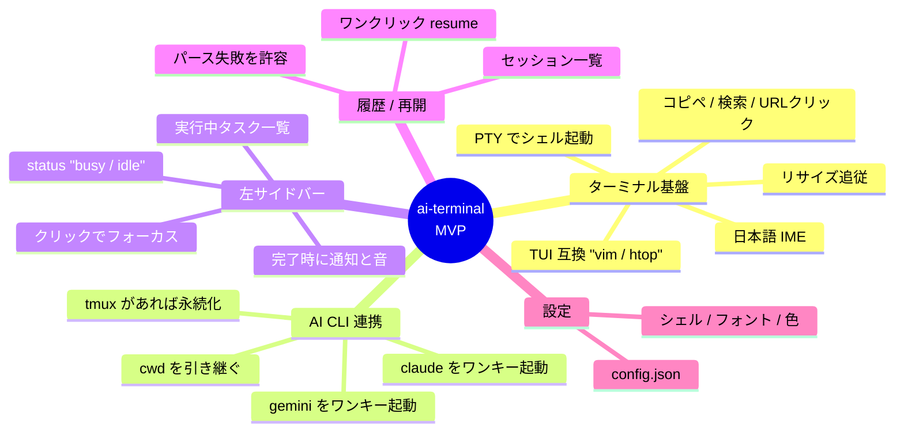
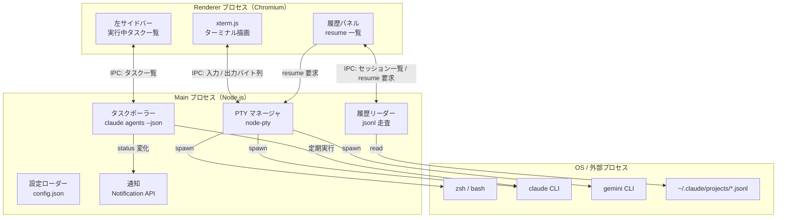
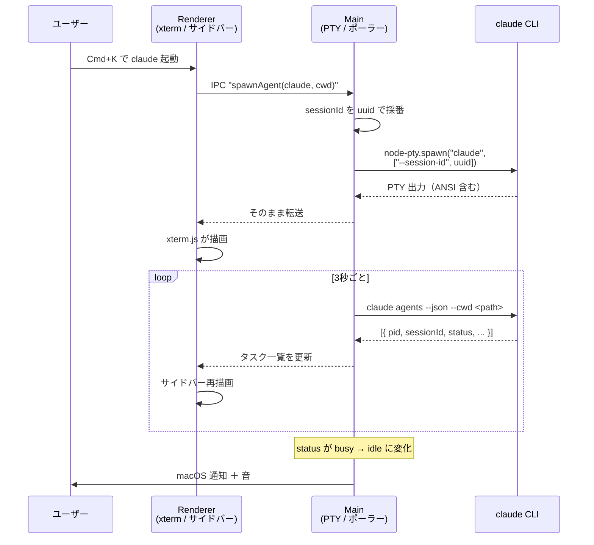
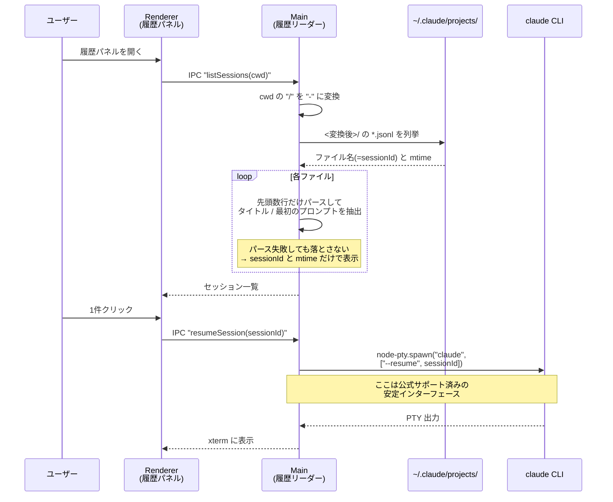
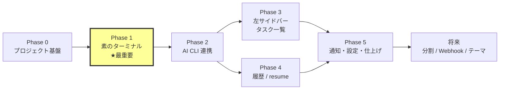

# ai-terminal 開発プラン

作成日: 2026-07-27
リポジトリ: https://github.com/Yoshinaga-iwnl/ai-terminal

## 決定事項（2026-07-27 承認済み）

| 項目 | 決定 |
|---|---|
| 技術スタック | **Electron + xterm.js(@xterm/xterm 6.0) + node-pty** で確定 |
| UI ライブラリ | **React** |
| MVP 追加機能 | **全4件を採用** — コピペ・検索・URL クリック / タスク完了通知＋音 / tmux 永続化（あれば使う） / タブ（最低2枚） |
| 日本語 IME | Phase 1 の受け入れ基準として必須（3-2 A） |
| 設定ファイル | `~/.ai-terminal/config.json` を Phase 5 で作成（3-2 F。タブ・配色を持つため必要） |

→ タブは「余力があれば」ではなく **MVP 確定スコープ**に格上げ。Phase 5 で実装する。

---

## 1. このプロジェクトで作るもの

**AI コーディングエージェント（Claude Code / Gemini CLI）を飼うことに最適化した、自分専用のターミナルアプリ。**

普段使いのターミナルとして成立しつつ、左サイドバーで「いま AI が何をしているか」が常に見えて、過去のセッションをワンクリックで再開できる状態を目指す。

着想元は [receptron/mulmoterminal](https://github.com/receptron/mulmoterminal) と [Zenn: 自作ターミナル 500 commits](https://zenn.dev/singularity/articles/diy-terminal-500-commits)。

---

## 2. 調査結果サマリ

### 2-1. mulmoterminal から学べること

| 項目 | 実態 |
|---|---|
| 形態 | **Electron ではない**。`npx mulmoterminal` で Node サーバが起動し、ブラウザ（localhost:34567）で開く Web アプリ |
| スタック | Node.js + Express 5 + Vue 3 + Vite + TailwindCSS 4 / `@xterm/xterm` 6.0 + `node-pty` 1.1 / WebSocket + Socket.IO |
| AI 連携 | **API キーを一切使わない**。`claude` / `codex` の公式 CLI バイナリを `node-pty` で子プロセス起動し、PTY 出力をそのまま WebSocket → xterm.js に流すだけ |
| 状態検知 | Claude Code の **Hooks**（UserPromptSubmit / PreToolUse / Stop / Notification）をサーバの HTTP エンドポイントに向けさせ、working / waiting / done を判定してグリッドの枠色に反映 |
| 永続化 | `tmux new-session -A` でラップ。サーバやブラウザを落としても Claude セッションが生き残る |
| リッチ出力 | in-process の MCP サーバを `--mcp-config` で Claude に握らせ、フォーム・チャート・画像を別パネル（Canvas）に描画 |
| 規模 | 2026-06-14 開始、約6週間で **1960 コミット**。server 側だけで 100 ファイル超。star 31、実質1名開発 |
| ライセンス | MIT |

**要点**: 「AI CLI をそのまま PTY で飼う」という一番おいしい設計は、我々もそのままコピーできる。API キーを使わないというユーザー要件と完全に一致する。

一方、会計・カレンダー・翻訳・Wiki まで載っている巨大プロジェクトなので、**機能面を真似すると確実に発散する**。参考にするのは設計の骨格だけにする。

### 2-2. Zenn 記事から学べること

- 開発動機は「`-p`（非対話モード）で CLI を叩くと課金体系が変わり、自動で回すほど高くつく」→ だから **対話モードのまま PTY でラップする**という判断に至った。我々の「API キーを使わない」要件と同じ結論
- 機能を作った順番: **6分割 → 状態表示（idle / running / 入力待ち）→ 色分け → 音声通知 → リモート監視 → Push通知**。一貫して「こっちから探しに行かなくて済むようにする」という思想
- 最大のハマりどころ: **静的な等分割ペインは使い物にならなかった**。「どれが終わっていて、どれが入力待ちで、どれがまだ動いているのか、パッと見で分からない」。並列で回すとき一番消耗するのは「今どれが自分を待っているのか」を探す時間
- ただし記事は**エッセイ寄りで、PTY / 描画 / IME の実装詳細は書かれていない**

**要点**: 「実行中タスク一覧」を MVP に入れるという判断は正しい。むしろこれがこのアプリの本体。

### 2-3. 実機で検証した技術的事実（最重要）

このマシン（macOS / Claude Code v2.1.220 / Gemini CLI v0.37.0）で実際にコマンドを叩いて確認した。

#### `claude agents --json` が使える

```jsonc
[
  { "pid": 44518, "cwd": "/Users/.../gecipe-esports-english",
    "kind": "interactive", "startedAt": 1785126904035,
    "sessionId": "4e3e1fb2-...", "name": "...", "status": "busy" },
  { "pid": 7026,  "cwd": "/Users/.../ai-terminal", ... }
]
```

- `--cwd <path>` で絞り込み、`--all` で終了済みも含む
- Web 上の二次情報は「バックグラウンド agent しか出ない」と書いているが、**実機では対話セッションも列挙された**（実機が正）
- **左サイドバーの「実行中タスク一覧」は、これを数秒間隔でポーリングするだけで作れる**

**2026-08-07 追記（claude 2.1.224 で再測定）。この形式は実際に変わった。**

```jsonc
[
  { "pid": 47307, "cwd": "/Users/.../gecipe-esports-english",
    "kind": "interactive", "startedAt": 1786089581160,
    "sessionId": "82dae66a-...", "name": "...",
    "status": "waiting", "waitingFor": "permission prompt" }
]
```

- **`status` に `waiting` が増えた。** `waitingFor` が添えて返り、バイナリを読んで確認した値は
  `permission prompt` / `input needed` / `dialog open` の3つ。いずれも人間が操作するまで進まない
  （`src/shared/agent-status.ts` が `your-turn` に翻訳している根拠。Issue #241 周2）
- ⛔ **`sessionId` は一意ではない。** CLI 内の `/resume` で**同じ `sessionId` を持つ別プロセスが
  複数返る**。突き合わせに使えるのは pid のほう（`src/shared/taskIdentity.ts`）。
  これを sessionId で畳んでいたために、完了通知が3秒ごとに鳴り続けていた（Issue #241 周1）

#### セッション履歴の在り処

- `~/.claude/projects/<パスの / を - に置換>/​<sessionId>.jsonl`
  - 例: `/Users/yoshinaga/Desktop/job/ai-terminal` → `-Users-yoshinaga-Desktop-job-ai-terminal`
  - 元のディレクトリ名にハイフンが入ると**非可逆**。逆変換で元パスを一意に復元できないので、cwd から同じ変換をかけて照合する方向でのみ使う
- jsonl の各行は `type` で種別が分かれる（`user` / `assistant` / `ai-title` / `last-prompt` / `file-history-snapshot` など）。共通フィールドに `sessionId` `cwd` `timestamp` `gitBranch` `version` がある
- **公式ドキュメントは「この形式は内部フォーマットでバージョン間で変わる。直接パースするスクリプトは壊れる」と明記している**
  - → 履歴一覧は「ベストエフォート表示」に留める。パース失敗時はファイル名（sessionId）と mtime だけで表示する防御的な作りにする
  - → **再開そのものは `claude --resume <sessionId>` を PTY で起動するだけ**なので、ここは公式サポート済みの安定インターフェース。壊れるのは「一覧のプレビュー表示」だけ

#### 使える CLI フラグ

| フラグ | 用途 |
|---|---|
| `-r, --resume [id]` | セッション再開（ID 指定 / 省略時は対話ピッカー） |
| `-c, --continue` | 直近セッションの継続 |
| `--session-id <uuid>` | セッション ID を**こちらから指定して**開始 ← 起動したセッションを自前で追跡できる |
| `-n, --name <name>` | セッション表示名 |
| `--fork-session` | resume 時に新 ID を払い出す |
| `claude agents --json` | 起動中セッション一覧 |

#### Gemini CLI

- インストール済み（v0.37.0）
- **`--list-sessions` が存在する**（Claude Code には無い。履歴一覧はこちらの方が公式に親切）
- `-r, --resume <"latest"|index>` … Claude の UUID ベースと違い **index ベース**
- `--acp`（Agent Client Protocol / JSON-RPC over stdio）、`gemini hooks migrate`（Claude の hooks を移植するコマンド）も存在
- 認証方式がサブスクリプションか API キーかは**未確認**（実装時に要確認）

---

## 3. MVP の擦り合わせ

### 3-1. 元の要件の評価

| 元の要件 | 判定 | コメント |
|---|---|---|
| 通常のターミナルと同じ操作 | **採用（最優先）** | ここが崩れると日常使いできず、他の機能が全部無意味になる。最初のマイルストーンに置く |
| Claude Code / Gemini CLI 連携（CLI 版） | **採用** | PTY で子プロセス起動する方式で確定。API キー不要 |
| 左サイドに実行中 Claude タスク一覧 | **採用** | `claude agents --json` のポーリングで実現可能。裏取り済み |
| 履歴（resume 一覧）と再立ち上げ | **採用（ただし段階的）** | 再開は安定。一覧のプレビュー表示だけは壊れうる前提で作る |

### 3-2. MVP に追加すべきと考える機能（提案）

| # | 追加提案 | 理由 |
|---|---|---|
| A | **日本語 IME の動作を受け入れ基準に明記** | 「通常のターミナルと同じ操作」の中で一番壊れやすい。xterm.js + WebView 系は変換中の下線表示で不具合が出る事例がある。後から直すのが最も高くつくので、Phase 1 の合格条件に入れる |
| B | **コピー / ペースト・URL クリック・文字列検索** | ターミナルとして「普通に使える」ために事実上必須。xterm.js のアドオン（clipboard / web-links / search）を入れるだけで済むので、MVP に含めてもコストがほぼゼロ |
| C | **セッション永続化（アプリを落としても claude が死なない）** | mulmoterminal が tmux でやっていること。AI に長い作業をさせている最中にアプリを再起動できないのは実用上つらい。ただし実装は重いので **MVP では「tmux があればラップする」オプション扱い**にして、無ければ普通に起動する |
| D | **タスク完了時の macOS 通知＋音** | Zenn 記事で「一番消耗するのは、今どれが自分を待っているのかを探す時間」と明言されている核心機能。将来の Webhook 通知の前段としても自然。実装は Electron の Notification API で数行 |
| E | **タブ（最低2つ）** | 分割は将来でよいが、タブが1枚も無いと「ターミナルの代替」として使えない。ただしスコープが膨らむため **MVP の最後に、余力があれば**という位置づけ |
| F | **最小限の設定ファイル（シェル / フォント / フォントサイズ / ポーリング間隔）** | 「カラーチェンジ」を将来やるなら、設定を読む土台は先に作っておいた方が安い。`~/.ai-terminal/config.json` 1枚で足りる |

### 3-3. MVP に入れないもの（意図的に見送る）

- ターミナル分割（将来）
- Webhook 通知（将来。macOS 通知を先に作る）
- カラーテーマ切替 UI（将来。設定ファイルでの色指定までは MVP）
- MCP によるリッチ GUI 出力（mulmoterminal の Canvas 相当。面白いが MVP には過剰）
- git worktree 統合、複数セッションのグリッド表示（並列運用を始めてから考える）
- リモート監視 / モバイル対応

### 3-4. 確定 MVP スコープ



---

## 4. 技術スタック

### 4-1. 比較

| 評価軸 | **A. Electron + xterm.js + node-pty** | B. Tauri v2 + xterm.js + Rust PTY | C. ローカル Web サーバ + ブラウザ（mulmoterminal 方式） |
|---|---|---|---|
| PTY | ◎ VS Code 本体と同じ構成。最も枯れている | ◎ `portable-pty`（wezterm 製）で可能 | ◎ node-pty そのまま |
| 日本語 IME | ◎ Chromium の IME 実装は非常に成熟 | △ WKWebView × xterm.js の composition 処理は**未検証** | ◎ ブラウザ依存で成熟 |
| TUI 互換（vim / htop） | ◎ 実績多数 | ○ 実例はあるが実機検証が必要 | ◎ |
| 「ターミナルの代替」としての使い勝手 | ◎ ネイティブウィンドウ、キーバインドを全部自分で握れる | ◎ 同上 | ✕ **ブラウザのショートカットと衝突する**（Cmd+W で閉じる等）。日常ターミナルには向かない |
| 起動速度 / サイズ | △ Chromium 同梱で 100MB 超、起動 1〜2秒 | ◎ OS 標準 WebView で数十MB | ◎ |
| 学習コスト | ◎ TypeScript だけで完結 | △ Rust の学習が必要 | ◎ |
| エコシステム | ◎ VS Code / Hyper など情報量が最大 | ○ PTY 周りはコミュニティプラグイン頼み | ◎ |

### 4-2. 推奨: **A. Electron + xterm.js + node-pty**

**理由**:

1. MVP 最優先要件が「通常のターミナルと同じ操作」である以上、**IME と TUI 互換性のリスクを最小化する選択が正しい**。ここが壊れると全部が無意味になる
2. VS Code の統合ターミナルと**完全に同じ構成**なので、詰まったときの情報量が段違い
3. PTY 制御・`claude agents --json` のポーリング・jsonl の走査が**全部 TypeScript で書ける**。Rust を挟むと2言語運用になる
4. Tauri の利点（軽さ・起動速度）は魅力だが、VS Code を日常的に使えているなら Electron の重さは許容範囲。**軽さのために互換性リスクを取る場面ではない**

**却下理由**:
- **C（ブラウザ方式）** … 実装は最速だが、ブラウザのキーバインドと衝突して「普段使いのターミナル」にならない。mulmoterminal がこれを選べたのは「AI 監督用コックピット」であって普段使いのターミナルではないから。我々の要件とは前提が違う
- **B（Tauri）** … 将来的に軽量化したくなったら移行候補。フロントを xterm.js で組んでおけば UI 層はほぼ流用できるので、**今 Electron を選んでも Tauri への道は塞がらない**

### 4-3. 採用ライブラリ（バージョンは 2026-07-27 時点の npm 実測値）

| パッケージ | バージョン | 用途 |
|---|---|---|
| `electron` | 43.2.0 | アプリ本体 |
| `@xterm/xterm` | 6.0.0 | ターミナル描画。**旧 `xterm` (5.3.0) は deprecated。必ず `@xterm/` を使う** |
| `@xterm/addon-fit` | 0.11.0 | リサイズ追従（必須） |
| `@xterm/addon-webgl` | 0.19.0 | 描画高速化。vim / htop のスクロール性能に効く |
| `@xterm/addon-unicode-graphemes` | 0.4.0 | 日本語・絵文字の文字幅計算（**日本語表示崩れの対策**） |
| `@xterm/addon-search` | 0.16.0 | 検索 |
| `@xterm/addon-clipboard` | 0.2.0 | コピペ |
| `@xterm/addon-web-links` | — | URL クリック |
| `node-pty` | 1.1.0 | PTY。Microsoft 管理。prebuild を試して失敗時のみ node-gyp にフォールバックする作り。**Electron では `@electron/rebuild` (4.2.0) が必要になる場合あり** |
| `vite` + `electron-vite` | 最新 | ビルド |
| TypeScript | 最新 | 全体 |
| UI | React or Vue（**どちらでも可。好みで決めてよい**） | サイドバー・履歴パネル |

---

## 5. アーキテクチャ

### 5-1. プロセス構成



**設計上の要点**:

- **Renderer は一切 OS を触らない**。PTY 起動もファイル読み込みも全部 Main プロセス側。`contextIsolation: true` / `nodeIntegration: false` を維持し、`preload` の contextBridge で必要な IPC だけ露出する
- **PTY の出力は加工せずそのままバイト列で流す**。ANSI エスケープを自前で解釈しない。これが mulmoterminal の一番賢いところで、CLI 側が新機能を出しても勝手に追従できる
- タスクポーラーと履歴リーダーは PTY と完全に独立。片方が壊れてももう片方は動く

### 5-2. AI CLI を起動してから一覧に出るまで



### 5-3. 履歴からの再開



### 5-4. ディレクトリ構成（案）

```
ai-terminal/
├── docs/
│   └── PLAN.md              # このファイル
├── src/
│   ├── main/                # Main プロセス
│   │   ├── index.ts         # エントリ / ウィンドウ生成
│   │   ├── pty/
│   │   │   ├── manager.ts   # PTY のライフサイクル管理
│   │   │   └── tmux.ts      # tmux ラップ（あれば使う）
│   │   ├── agents/
│   │   │   ├── claude.ts    # 起動引数ビルド / agents --json
│   │   │   ├── gemini.ts    # 起動引数ビルド / --list-sessions
│   │   │   └── poller.ts    # 定期ポーリング
│   │   ├── history/
│   │   │   ├── paths.ts     # cwd → ~/.claude/projects のパス変換
│   │   │   └── reader.ts    # jsonl の防御的パース
│   │   ├── config.ts        # ~/.ai-terminal/config.json
│   │   └── notify.ts        # 通知 ＋ 音
│   ├── preload/
│   │   └── index.ts         # contextBridge で IPC を露出
│   └── renderer/            # Renderer プロセス
│       ├── App.tsx
│       ├── terminal/        # xterm.js のラッパ
│       ├── sidebar/         # 実行中タスク一覧
│       └── history/         # resume 一覧
├── electron.vite.config.ts
├── package.json
└── CLAUDE.md                # 実装ルール（後で作る）
```

---

## 6. 実装フェーズ



### Phase 0 — プロジェクト基盤

- Electron + electron-vite + TypeScript + UI ライブラリのセットアップ
- `contextIsolation: true` / `nodeIntegration: false` の安全な初期構成
- ESLint / Prettier
- **完了条件**: 空のウィンドウが起動する

### Phase 1 — 素のターミナル（★最重要マイルストーン）

ここが通らなければ以降に進む意味がない。

- `node-pty` でログインシェルを起動、xterm.js に接続
- fit / webgl / unicode-graphemes / search / clipboard / web-links アドオン導入
- ウィンドウリサイズ → PTY のリサイズ通知

**完了条件（受け入れ基準）**:
- [ ] `vim` を開いて編集・保存でき、画面が崩れない
- [ ] 全画面を書き換える TUI が崩れずに描画・更新され、終了後にプロンプトへ戻る
      （代替画面の出入り・高頻度の再描画。`top` / `htop` などで確認する）
- [ ] マウスでテキストを選択でき、選択範囲がハイライトされる
- [ ] **日本語を IME で入力でき、変換中の表示が崩れない**
- [ ] 日本語・絵文字を含む出力で文字幅がずれない
- [ ] ウィンドウをリサイズしても表示が追従する
- [ ] Cmd+C / Cmd+V でコピペできる
- [ ] Ctrl+C で実行中プロセスを止められる
- [ ] `ls --color` の色が正しく出る

> この Phase で IME に致命的な問題が出た場合のみ、スタックを再検討する（が、Electron で出る可能性は低い）。

### Phase 2 — AI CLI 連携

- ショートカット（例: Cmd+K）で現在の cwd に `claude` を起動
- 同様に `gemini` を起動
- 起動時に `--session-id <uuid>` を渡し、**アプリ側が起動したセッションを自前で追跡できるようにする**
- `tmux` が存在すれば `tmux new-session -A -s <id> -- claude ...` でラップ（無ければ素で起動）

**完了条件**: アプリ内で `claude` が対話モードで動き、普段のターミナルと同じ体験になる

### Phase 3 — 左サイドバー / 実行中タスク一覧

- Main プロセスで `claude agents --json` を 3秒間隔でポーリング
- 一覧を `cwd` / `name` / `status` / 経過時間で表示
- `status` で色分け（busy / idle）
- クリックでそのセッションのターミナルにフォーカス
- ポーリング間隔は設定ファイルで変更可能に

**完了条件**: 別ターミナルで `claude` を起動しても一覧に現れる

### Phase 4 — 履歴 / resume

- cwd → `~/.claude/projects/<変換後>/` のパス解決
- `*.jsonl` を列挙し、mtime 降順で表示
- 各ファイルの先頭数行だけを**防御的に**パースしてタイトル / 冒頭プロンプトを抽出
  - **パース失敗しても絶対に落とさない**。失敗時は sessionId と mtime だけ表示
  - スキーマの前提を1ファイル（`history/reader.ts`）に閉じ込め、CLI 更新で壊れても直す場所が1箇所で済むようにする
- クリックで `claude --resume <sessionId>` を PTY 起動
- Gemini 側は `gemini --list-sessions` の出力をパース（index ベース）

**完了条件**: 過去セッションを一覧から選んで再開できる

### Phase 5 — 通知・設定・仕上げ

- `status` が busy → idle に変化したら macOS 通知＋音
- `~/.ai-terminal/config.json`（シェル / フォント / フォントサイズ / 配色 / ポーリング間隔）
- 余力があればタブ

---

## 7. リスクと対策

| リスク | 影響 | 対策 |
|---|---|---|
| **`~/.claude/projects/*.jsonl` の形式が CLI 更新で変わる** | 履歴一覧のプレビューが壊れる | 公式が「内部形式・壊れうる」と明記済み。パースを1ファイルに閉じ込め、失敗時は sessionId と mtime だけで表示。**再開機能自体は `--resume` なので影響を受けない** |
| **`claude agents --json` の出力形式が変わる** | サイドバーが空になる | 同様に1ファイルに閉じ込める。パース失敗時はサイドバーに「取得失敗」と出すだけでアプリは落とさない |
| **`claude agents --json` が他プロジェクトのセッションまで拾う** | ノイズになる（が、全体が見えるのは長所でもある） | `--cwd` で絞り込むモードと全体表示モードを切り替えられるようにする |
| **node-pty のネイティブビルド失敗** | 起動不能 | prebuild が効かない場合は `@electron/rebuild`。Phase 0 の時点で一度確認しておく |
| **日本語 IME の不具合** | 日常使いできない | Phase 1 の受け入れ基準に明記。ここで検証してから先に進む |
| **Gemini CLI の認証方式が未確認** | API キーが必要だと要件を満たさない | Phase 2 の着手時に `gemini` を素で起動して確認する。最悪 Claude 専用でも MVP は成立する |
| スコープの発散 | 完成しない | mulmoterminal の機能を追わない。「見送るもの」リスト（3-3）を守る |

---

## 8. 未確定事項（実装前に決めたいこと）

1. **UI ライブラリを React と Vue のどちらにするか** — どちらでも成立する。慣れている方でよい
2. **Gemini CLI の認証方式** — Phase 2 で実機確認
3. **tmux 永続化を MVP に入れるか** — 「あれば使う」オプション扱いを提案しているが、不要なら Phase 2 から外してよい
4. **タブを MVP に入れるか** — 余力次第。無くても MVP は成立する

---

## 9. 実装状況（2026-07-27 時点）

Phase 0 から Phase 5 までの**コードは一通り実装済み**。`npm run typecheck` / `npm run lint` / `npm run build` は通り、`npm run dev` でウィンドウが起動することまで確認済み。

**ただし Phase 1 の受け入れ基準（vim / htop / 日本語 IME / コピペ）は、GUI 操作を伴うため未検証。** ここは実際に触って確認する必要がある。

実装時に IPC 契約へ追加したもの:
- `app.paths()` — Renderer は Node API に触れないため、アプリ起動時の cwd とホームディレクトリを Main から供給する。履歴一覧の探索キーと PTY の初期作業ディレクトリに使う

判明した設計上の注意点:
- **tmux でラップした場合も、内側の `claude` が終了すれば `ptyExit` は発火する**（内側の終了 → tmux セッション終了 → クライアント終了、という連鎖を tmux なしと同じく辿るため。2026-08-03、tmux 3.7b で実測）。**罠は逆で、タブを閉じる操作（tmux クライアントの kill）ではサーバ側のセッションと内側の `claude` / `gemini` プロセスが生き残ること。** 詳細と対策は [.claude/skills/terminal/reference/pty-pitfalls.md](.claude/skills/terminal/reference/pty-pitfalls.md) を参照
- `ai-title` が未生成のセッションでは履歴の `title` が取れない（実データ 328 件で取得率 86%）。UI は `firstPrompt` へフォールバックする
- Gemini CLI の `--list-sessions` は **JSON ではなくプレーンテキスト**を返す（`-o json` を付けても変わらない）。パースは正規表現ベースの近似で、相対時刻（"5 minutes ago" 等）から epoch を推定している

## 10. 承認をお願いしたいこと

- [ ] MVP スコープ（3-4 のマインドマップ）でよいか
- [ ] 追加提案した機能（3-2 の A〜F）の採否
- [ ] 技術スタックを **Electron + xterm.js + node-pty** で確定してよいか
- [ ] UI ライブラリ（React / Vue）の選択
- [ ] Phase 0 → 1 から着手してよいか

承認いただければ Phase 0（プロジェクト基盤）から実装を開始します。
